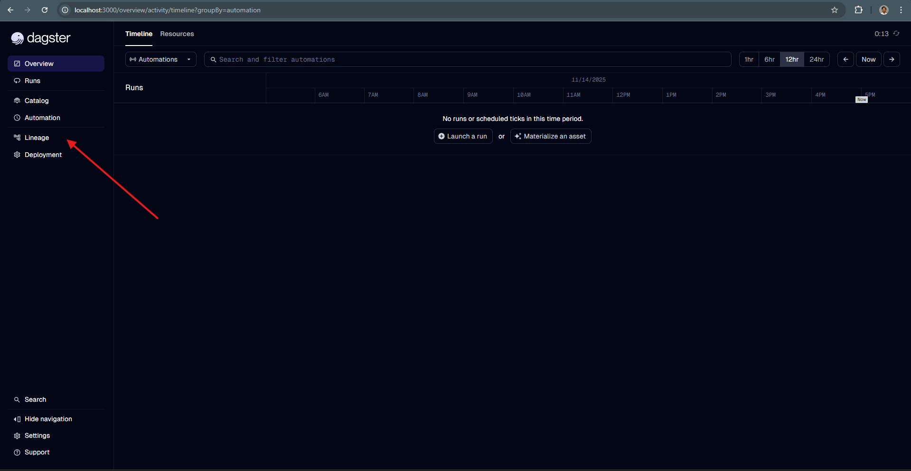
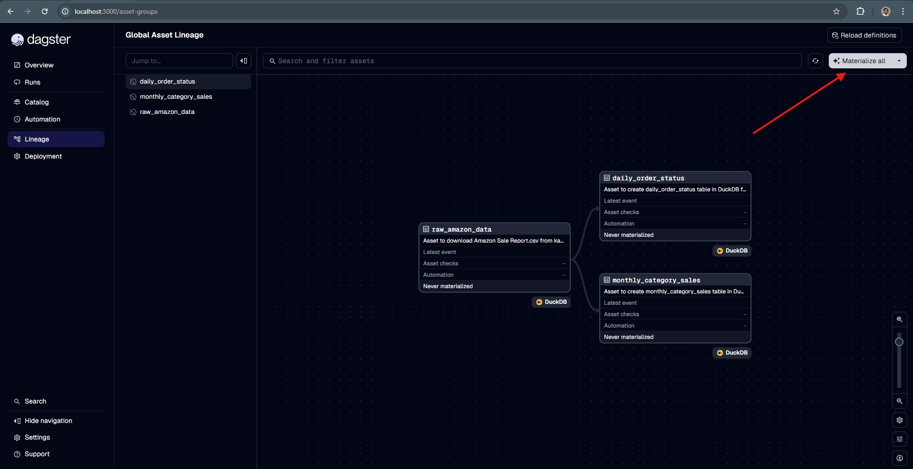
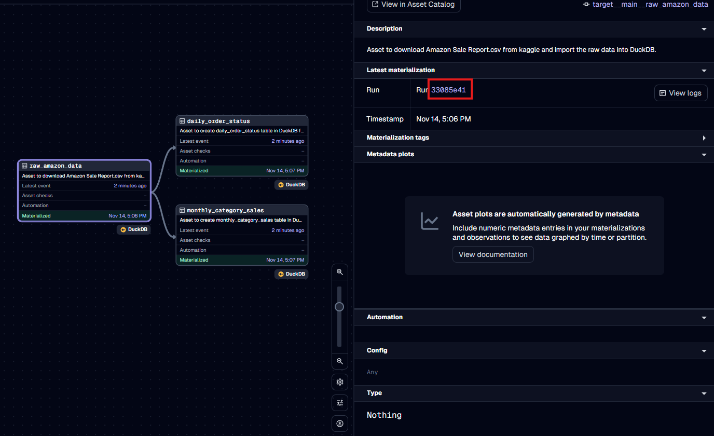
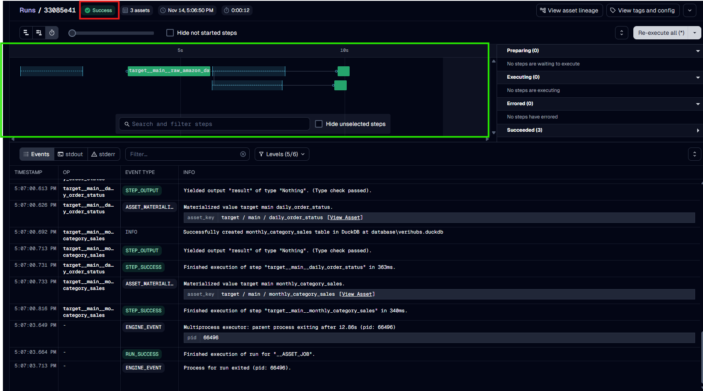
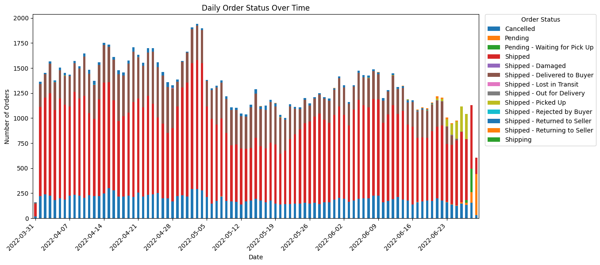
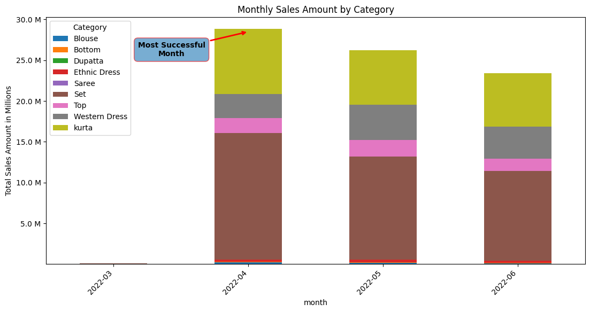

# Verihubs Technical Test

This repository is dedicated to deliver all requirements for [verihubs technical test](https://docs.google.com/document/d/1Ipl2y1xfPakl40nlZjB-Iw7EkZeAm3Cg7_yaFBVibao/edit?tab=t.0). This README.md will guide users to install and run *Verihubs Project* to be able running the data pipeline and then the visualization and findings from that data.

---------------------------------------------

## Verihubs Pipeline Guide

### Getting started

#### 1. Installing dependencies

**Option 1: uv**
Ensure [`uv`](https://docs.astral.sh/uv/) is installed following their [official documentation](https://docs.astral.sh/uv/getting-started/installation/).
Create a virtual environment, and install the required dependencies using _sync_:

```bash
uv sync
```

Then, activate the virtual environment:

| OS | Command |
| --- | --- |
| MacOS | ```source .venv/bin/activate``` |
| Windows | ```.venv\Scripts\activate``` |

**Option 2: pip**
Install the python dependencies with [pip](https://pypi.org/project/pip/):

```bash
python3 -m venv .venv
```

Then activate the virtual environment:

| OS | Command |
| --- | --- |
| MacOS | ```source .venv/bin/activate``` |
| Windows | ```.venv\Scripts\activate``` |

Install the required dependencies:

```bash
pip install -e ".[dev]"
```

#### 2. Running Dagster

Start the Dagster UI web server:

```bash
dg dev
```

Open http://localhost:3000 or http://127.0.0.1:3000 in your browser to see the project.


#### 3. Materialize Assets
**1. Go to lineage to see the assets from the project**


**2. Click Materialize all**


#### 4. Audit The Run
**1. Still on the lineage page, click on of the asset and find Run _Code_**


**2. Audit several point**
- Check Red Box in the image, if it should be appear as success
- Check Green Box in the mage, it tells us how long should it take to run the whole materialize process


------------------------------------------------------------------------

## Visualization Task

The visualization is location on `visualization_and_findings.ipynb` and all you need to do is run all and it will show the visualization for you

### Findings

#### 1. Daily order by order status



Based on this daily order by status, it seems like it has kind of *seasonal* order pattern but we need to analyze further for this. But from this raw daily trend it self, in **April** it has the biggest order among other months and we have the **peak** order on **late April - early May**.

#### 2. Monthly Revenue



Based on total revenue we can easily tell April is the most profitable month in the dataset and the trend is declined from month to month until June.

